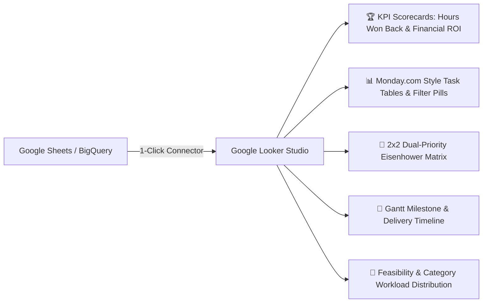

# Google Looker Studio Executive Dashboard Setup Guide

## 1. Overview
This guide provides the complete blueprint for creating your **Google Looker Studio Executive Work Hub & KPI Dashboard** connected to your Google Sheets / BigQuery Data Warehouse.

---

## 2. 3-Minute Setup Instructions

1. Navigate to **[https://lookerstudio.google.com](https://lookerstudio.google.com)**.
2. Click **Create ➕** $\to$ **Report**.
3. In the **Add data to report** dialog, select **Google Sheets** (or **BigQuery**).
4. Select spreadsheet: **"Executive Assistant Work Hub - Data Warehouse"** $\to$ Worksheet: **`Tasks_Ledger`** $\to$ Click **Add**.

---

## 3. Chart Configurations & Calculated Fields

### 1. Executive KPI Scorecards (Top Row)
Add 4 **Scorecard with Compact Numbers** widgets across the top:

| Scorecard Title | Field / Formula | Format | Target Value |
| :--- | :--- | :--- | :--- |
| **Total Hours Won Back** | `SUM(Hours Won Back)` | Number (`h`) | `+350h` |
| **Gross Financial ROI ($)** | `SUM(Financial Value Won ($))` | Currency (`USD $`) | `$70,000` |
| **Automation ROI Multiplier**| `SUM(Hours Won Back) / SUM(Hours Invested)` | Number (`x`) | `6.2x` |
| **AI Automation Share** | `COUNT_DISTINCT(CASE WHEN Feasibility = 'ai_automated' THEN Task ID END) / COUNT_DISTINCT(Task ID)` | Percentage (`%`) | `75%` |

---

### 2. The 2x2 Dual-Priority Eisenhower Matrix (Scatter Chart)
- **Chart Type**: Scatter Chart / Bubble Chart
- **X-Axis (Dimension)**: `User Priority` (Values: `low`, `medium`, `high`, `urgent`)
- **Y-Axis (Metric)**: `AI Priority` (Values: `defer`, `low`, `medium`, `high`, `critical`)
- **Size Metric**: `Hours Won Back`
- **Color Dimension**: `Feasibility`
- **Labels**: `Title`
- **Result**: Visualizes high-urgency vs high-leverage tasks in 4 quadrants.

---

### 3. Monday.com Style Interactive Work Hub Table
- **Chart Type**: Table with Bars & Heatmap
- **Dimensions**:
  1. `Category` (Group Header)
  2. `Title` (Task Name)
  3. `User Priority`
  4. `AI Priority`
  5. `Feasibility`
  6. `Status`
  7. `Assignee`
  8. `Due Date`
- **Metrics**:
  - `Hours Won Back` (Bar metric)
  - `Financial Value Won ($)` (Heatmap metric)
- **Conditional Formatting**:
  - If `Status = 'completed'` $\to$ Background: Emerald Green (`#10b981`)
  - If `Status = 'in_progress'` $\to$ Background: Blue (`#3b82f6`)
  - If `Status = 'blocked'` $\to$ Background: Rose Red (`#f43f5e`)
  - If `Feasibility = 'ai_automated'` $\to$ Text: Teal (`#14b8a6`)

---

### 4. Feasibility & Category Workload Distribution (Donut Charts)
- **Chart 1 (Feasibility)**: Donut Chart
  - Dimension: `Feasibility` (`ai_automated`, `hybrid`, `human_only`)
  - Metric: `COUNT(Task ID)`
  - Colors: Teal (`#14b8a6`), Indigo (`#6366f1`), Amber (`#f59e0b`).
- **Chart 2 (Business Domains)**: Donut Chart
  - Dimension: `Category` (`Tech/Dev`, `Finance`, `Marketing`, `Strategy`, `Operations`)
  - Metric: `SUM(Hours Won Back)`

---

### 5. Gantt & Milestone Timeline
- **Chart Type**: Time Series / Gantt Chart
- **Time Dimension**: `Start Date`
- **End Date Dimension**: `Due Date`
- **Series Dimension**: `Category`
- **Metric**: `Average Progress (%)`

---

## 4. Automatic Refresh & Mobile Access
- **Auto-Refresh**: Set data freshness to **"Every 15 minutes"** in Looker Studio Settings.
- **Mobile Access**: Looker Studio reports are 100% mobile-responsive; bookmark the report URL on your iPhone/iPad for live on-the-go viewing.
